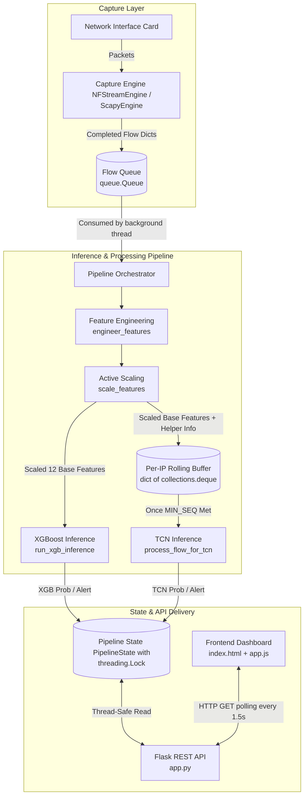

# Architecture Design Document

This document describes the architectural layout, data flow, threading model, and design choices of the NIDS-Live system.

## 1. System Data Flow

The diagram below details how network traffic flows from raw packet capture to the Flask REST API and web dashboard.

---

## 2. Model Execution and Ensembling

XGBoost and TCN models run **independently** rather than as an ensemble (such as a weighted average or meta-classifier). 
* **Independent Predictions**: In `pipeline/orchestrator.py` (lines 186–238), `run_xgb_inference` is executed for every incoming flow in the batch. Individually, for each flow, `process_flow_for_tcn` evaluates a rolling sequence window for that source IP.
* **Separated Alert Channels**: The outputs are stored as distinct fields in the flow result dictionary (`xgb_prob`, `xgb_alert`, `tcn_prob`, and `tcn_alert`). An alert is raised globally if *either* model flags a flow (i.e. `xgb_alert == 1` or `tcn_alert == 1`).
* **Design Rationale**: XGBoost acts as a per-flow detector focusing on immediate traffic features, whereas TCN evaluates sequential patterns over time (e.g., beaconing behavior) per IP. Keeping their outputs separate allows the dashboard operator to see exactly which detection mechanism triggered the alert.

---

## 3. Design Constraints & Parity

To prevent false positive spikes and model degradation from **domain shift**, the live inference pipeline adheres to strict constraints:
* **Exact Notebook Parity**: The system features are a direct port of the offline training notebook. No thresholds, feature normalization bounds, categorical mappings, or model parameters are altered live.
* **Yeo-Johnson PowerTransformer**: Base features are transformed using a static fitted `PowerTransformer` from training (standardized and clamped strictly between `[-4, 4]`).
* **Domain Adaptation / recalibration**: When running on new networks, domain shift is monitored via feature clipping statistics. The operator can run byte-column Yeo-Johnson lambdas adaptation and Isotonic recalibration layer updates (refer to [THRESHOLDS.md](file:///home/gokul-p/Project/Vandana_E2/pipeline/nids-live/docs/THRESHOLDS.md) for details).

---

## 4. Threading & Process Model

The application employs a hybrid threading model to ensure live packet capture and high-throughput model inference do not block Flask's web request handlers.

| Component | Execution Unit | Role / Behavior |
| :--- | :--- | :--- |
| **Flask API Server** | Flask Main / Request Threads | Serves HTML, handles REST API endpoints (GET `/api/flows`, GET `/api/status`, etc.), and updates sliders/calibration settings. |
| **Capture Engine** | Daemon `threading.Thread` | Spins in background. `nfstream_engine.py` runs `NFStreamer` in a daemon thread. `scapy_engine.py` runs Scapy's `AsyncSniffer`. |
| **Pipeline Orchestrator** | Background `threading.Thread` | Consumes flow dictionaries from the capture queue, performs scaling, runs inferences (CPU-pinned TensorFlow for TCN), and writes thread-safely into the state. |
| **Auto-Tuning Engine** | Background `threading.Thread` | Computes and adjusts thresholds every 5 minutes using a trailing window of raw scores. |

> [!NOTE]
> `nfstream_engine.py` executes `NFStreamer` in a daemon thread rather than a separate process. This layout allows the capture engine to be spawned dynamically from within Flask's request threads without raising `daemonic processes are not allowed to have children` exceptions.
